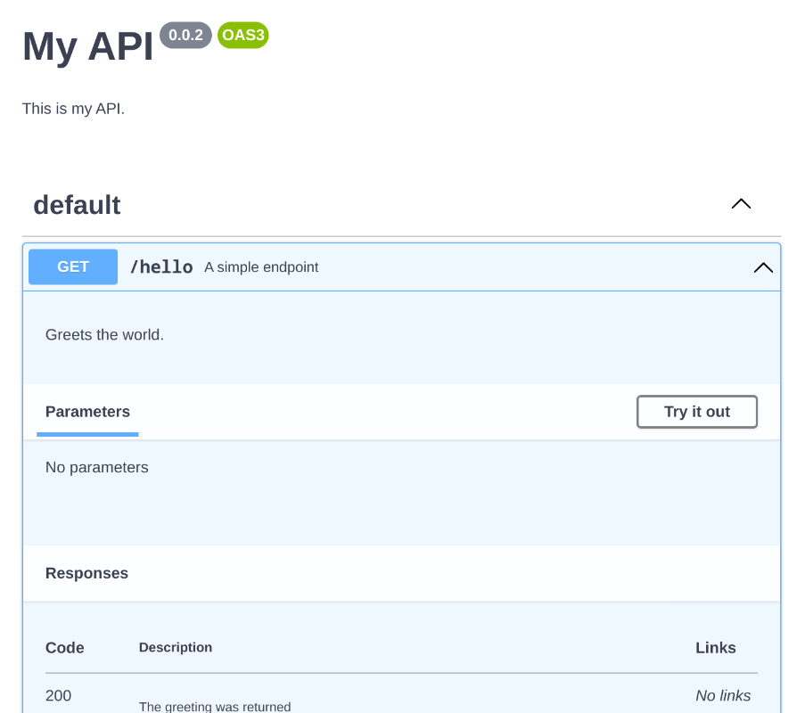
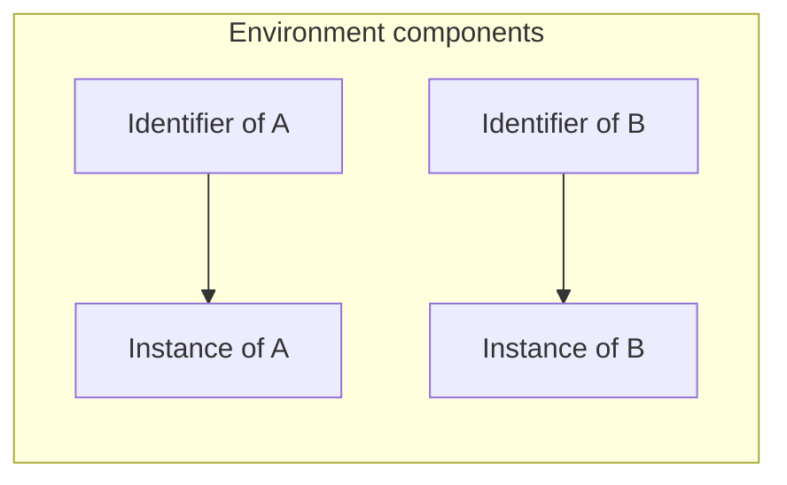
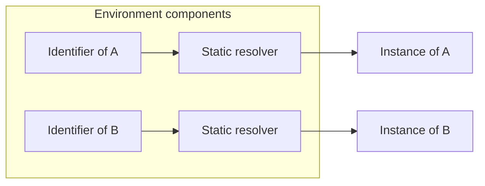
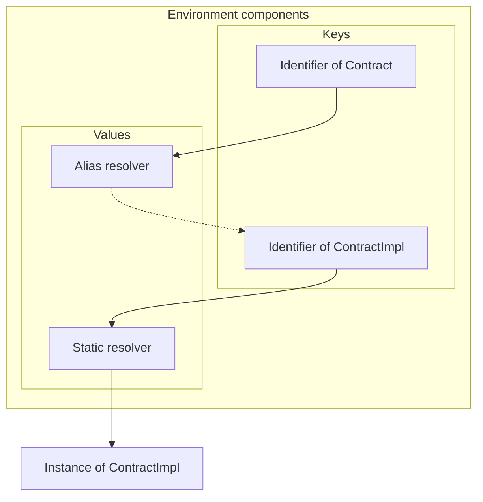
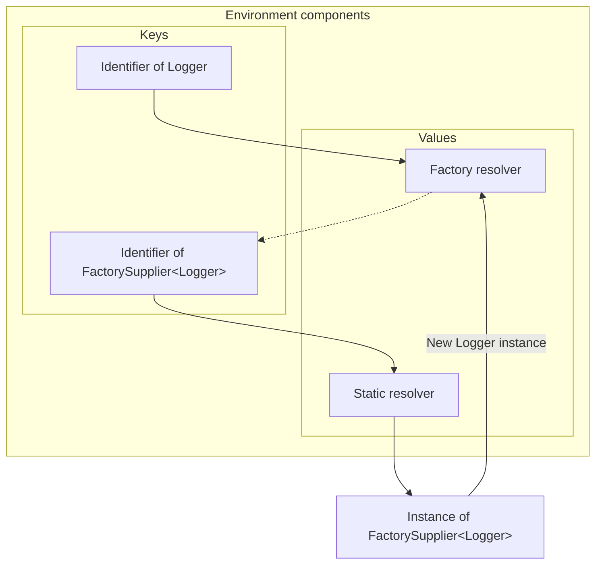

Tegral 0.0.2 is a massive update, with over 40 bullet points in our [changelog](https://github.com/utybo/Tegral/tree/main/CHANGELOG.md)! Let's go through the biggest changes, including new OpenAPI support, integration testing support, and more robust dependency injection internals!

<!--truncate-->


## OpenAPI support

As I mentioned in the [first blog post](../2022-06-02-tegral-001/index.md#whats-next), one of the next steps for me would be to migrate some other libraries I've made in the past to the Tegral framework. This was done with the migration of [Koa](https://github.com/utybo/Koa), a set of OpenAPI libraries. Koa was significantly improved (practically rewriting it) and has now become **Tegral OpenAPI**. This initial release includes:

- [DSL support](pathname:////docs/modules/core/openapi/dsl)
- [Scripting](pathname:///docs/modules/core/openapi/scripting)
- [Ktor support](pathname:///docs/modules/core/openapi/ktor)
- [Tegral Web support](pathname:///docs/modules/core/openapi/tegral-web)

### Authoring Tegral OpenAPI scripts

Here's an example of what documenting your API using OpenAPI looks like using Tegral OpenAPI:

```kotlin title="my_api.openapi.kts"
// Here, we have what we would put in the 'info' section of our OpenAPI file

title = "My API"
description = "This is my API."
version = "0.0.2"

// Let's describe a simple "Hello World!" endpoint

"/hello" get {
    summary = "A simple endpoint"

    description = "Greets the world."
    200 response {
        description = "The greeting was returned"
        plainText { schema("Hello World!") }
    }
}
```

You can then use the [CLI](pathname:///docs/modules/core/openapi/cli) to convert it to a proper OpenAPI file. The CLI itself has options for JSON, YAML and outputting to a file.

```bash
$ tegral-openapi-cli my_api.openapi.kts -f yaml -o output.yaml
[i] openapi.dump         - Compiling script...
[i] openapi.dump         - Evaluating script...
[!] compiler             - Using new faster version of JAR FS: it should make your build faster, but the new implementation is experimental
[i] openapi.dump         - Output written to /tmp/cli_demo/output.yaml
$ bat output.yaml
───────┬────────────────────────────────────────────────────────────────────────
       │ File: output.yaml
───────┼────────────────────────────────────────────────────────────────────────
   1   │ openapi: 3.0.1
   2   │ info:
   3   │   title: My API
   4   │   description: This is my API.
   5   │   version: 0.0.2
   6   │ paths:
   7   │   /hello:
   8   │     get:
   9   │       summary: A simple endpoint
  10   │       description: Greets the world.
  11   │       responses:
  12   │         "200":
  13   │           description: The greeting was returned
  14   │           content:
  15   │             text/plain:
  16   │               schema:
  17   │                 type: string
  18   │               example: Hello World!
───────┴────────────────────────────────────────────────────────────────────────

```

:::note

You can use [JBang](https://www.jbang.dev/) to easily run the Tegral OpenAPI CLI. In this case, your command would be:

```bash
jbang run guru.zoroark.tegral:tegral-openapi-cli:0.0.2
```

:::

This gives us the following output when ran through Swagger UI:



### Integration with Ktor

The new Tegral OpenAPI [Ktor and Ktor UI modules](pathname:///docs/modules/core/openapi/ktor) provide integration between OpenAPI, Swagger UI and Ktor.

#### Describe endpoints and applications

This module allows you to describe your Ktor application and endpoints directly in your code!

Let's implement the API we described above using Ktor:

```kotlin title="Controller.kt"
install(TegralOpenApiKtor) {
    title = "My API"
    description = "This is my API."
    version = "0.0.2"
}

routing {
    get("/hello") {
        call.respondText("Hello World!")
        // highlight-start
    } describe {
        summary = "A simple endpoint"

        description = "Greets the world."
        200 response {
            description = "The greeting was returned"
            plainText { schema("Hello World!") }
        }
    }
    // highlight-end
}
```

#### Serve the OpenAPI document

You can serve the OpenAPI document for your application using `openApiEndpoint()` just like you would use a `get` or `post`:

```kotlin
routing {
    openApiEndpoint("/openapi")
}
```

The endpoint has [a few parameters available](pathname:///docs/modules/core/openapi/ktor#describing-endpoints) to control its output.

#### Swagger UI

An additional plugin called [`TegralSwaggerUiKtor`](pathname:///docs/modules/core/openapi/ktor#tegral-openapi-ktorui) allows you to serve Swagger UI from your Ktor application, and bind it onto an OpenAPI endpoint. This can be the endpoint you set up using `openApiEndpoint`, or another endpoint entirely. This plugin does not require you to use `TegralOpenApiKtor`.

Setting up is as simple as:

```kotlin
install(TegralSwaggerUiKtor)

routing {
    swaggerUiEndpoint("/swagger", "/openapi")
}
```

### Tegral Web integration

If you use Tegral Web, you will only need to install the [OpenAPI feature](pathname:///docs/modules/core/openapi/tegral-web), which will:

- Install the OpenAPI and Swagger UI integrations
- Set up `/_t/openapi` for serving your OpenAPI document and `/_t/swagger` for serving Swagger UI.

Just do:

```kotlin
tegral {
    // ...
    install(OpenApiFeature)
    // ...
}
```

## Integration tests

Integration tests were added to Tegral!

Integration tests allow you to easily test the overall behavior of your application. A few scenarios match this:

- Testing interactions between components.
- Testing the behavior of the application as a whole (or with a set of components).

See the [last part of the Step 2 of the tutorial](pathname:///docs/get-started/tutorial/step-2-adding-tests#integration-testing) and the [Tegral Web AppTest](pathname:///docs/modules/web/apptest/) for more information.

Here's an example of an integration test setup:

```kotlin
class GreetingService {
    fun greet(who: String?): String = "Hello World!"
}

class GreetingController(scope: InjectionScope) : KtorController() {
    private val service: GreetingService by scope()

    override fun Routing.install() {
        get("/greet") {
            call.respond(service.greet())
        }
    }
}

val appModule = tegralDiModule {
    put(::GreetingService)
    put(::GreetingController)
}

class ExampleTest : TegralWebIntegrationTest({
    put(appModule)
}) {
    @Test
    fun `greet endpoint test without arguments`() = test {
        val result = client.get("/greet").body<Greeting>()
        assertEquals(Greeting("hello", "world"), result)
    }
}
```

## More flexible injections in Tegral DI

A pretty major (yet fully behind-the-scenes) change occurred in Tegral DI Core this version.

### Background

With version 0.0.1 (and with previous versions of [Shedinja](https://github.com/utybo/Shedinja)), environments used to have a 1-to-1 mapping of identifiers to actual object instances.



While this covered most simple cases, it was actually rather cumbersome for more advanced ones.

Let's take factories as an example: previously, you would have to do this to retrieve an object generated by a factory (say a logger):

```kotlin
class LogThings(scope: InjectionScope) {
    // highlight-start
    private val logger: Logger by scope.factory()
    // highlight-end
    // ...
}
```

Notice the extra `.factory`? This meant that you had to know in advance if the object you were trying to retrieve was a factory or not.

Even more problematic, some cases could just not be fulfilled. Say you have the following:

```kotlin
interface Contract {
    fun greet()
}

class ContractImpl : Contract {
    override fun greet() {
        println("Hello World!")
    }

    val notExposedThroughContact = "Secrets!"
}

class User(scope: InjectionScope) {
    // highlight-start
    private val contract: Contract by scope()
    // highlight-end

    fun doSomething() {

    }
}
```

Notice how we're referring to the `Contract` interface and not `ContractImpl`.

Now, we could do this previously by doing the following:

```kotlin
tegralDi {
    put<Contract>(::ContractImpl)
    put(::User)
}
```

But that wasn't always the best solution: what if we also want to be able to directly retrieve `ContractImpl`, say by this component:

```kotlin
class GiveMeSecrets(scope: InjectionScope) {
    private val contractImpl: ContractImpl by scope()

    fun doSomething() {
        println("The secret is: " + contractImpl.notExposedThroughContact)
    }
}
```

We would need some "aliasing" system, which would once again lead us to ugly "I-need-to-know-what-this-is-in-advance" situations.

Not anymore!

### The solution

The components contained in an environment were overhauled to now map identifiers to *resolvers*.



At first, this may seem just like complicating things, but if we now put an alias...



You can see that the resolver can "go back" in the keys to get the actual resolver it's interested in.

The same goes for factories:



As for our previous "alias" example, it can now work as-is using the following declarations:

```kotlin
tegralDi {
    put(::ContractImpl)
    putAlias<Contract, ContractImpl>()
    put(::User)
    put(::GiveMeSecrets)
}
```

### TL;DR

- You no longer need to put `by scope.factory()` to retrieve factories: you can just use `by scope()` instead.
- You can now add [aliases](pathname:///docs/modules/core/di/aliases) with `putAlias` and retrieve them using `by scope()`
- All of this is powered by a new "resolution" system for maximum flexibility. Hurray!

You can learn more about all of this in the new ["DI Internals" documentation page](pathname:///docs/modules/core/di/internals).

## Logging improvements

A few improvements were made to logging in Tegral Web applications.

### Configuration

You can now configure logging levels for the various loggers directly in your `tegral.toml` file:

```toml
[tegral.logging]
# Default root logging level
level = "Debug" 

[tegral.logging.loggers."my.logger"]
# Logging level for the "my.logger" logger
level = "Warn"
```

### Logging defaults

Logs will look a bit nicer by default in your Tegral Web applications (with colors for the logger and log level). Yay!

## Miscellaneous highlights

*For a full list of changes, please refer to our [changelog](https://github.com/utybo/Tegral/tree/main/CHANGELOG.md).*

- Tegral DI: `UnsafeMutableEnvironment`, which is the environment you use when testing Tegral DI-powered components, is now extensible. This allows you to install Tegral DI extensions in tests.

- Tegral Featureful: `LifecycleHookedFeature` features have appeared, which allow for more precise hooking into specific lifecycle events. These are mostly used by internal features, but can also be useful for external features.

- Tegral Web Controllers: `KtorApplication`'s `setup` function was removed, as it broke a few design patterns and ended up becoming a problem when developing integration tests. If you were directly implementing your own `KtorApplication`, you will need to move code that was in `setup` to a high-priority `KtorModule` instead.

- Tegral Web AppDefaults: All services will be cleanly stopped when the application is shut down (via Ctrl+C-ing for example).

- A few versions were bumped along the way, including Ktor, Kotlin, Gradle and Hoplite.

## Plans for the future

Unfortunately, as the summer will come to an end, so will the time I can fully dedicate to Tegral. For now, my focus will be on adding small features everywhere and adding more documentation as necessary.

Some more long-term goals are still database integration (with Exposed, and some Flyway-like tool).

## Final words

Thanks for your interest in Tegral! This has been a fun side project of mine, and I'm excited to see people try out some of the brand new features! Feel free to ask questions and report bugs via [GitHub issues](https://github.com/utybo/Tegral), I'm all ears!

Finally, I'd like to thank [sksamuel](https://github.com/sksamuel) for the extremely fast response to merging (and releasing!) the two PRs I made on [Hoplite](https://github.com/sksamuel/hoplite). Hoplite is the library used by Tegral Config to parse configuration files, and I encountered a few bugs along the way, which I fixed and submitted PRs for. I was a bit worried about not getting a release before a few months, but sksamuel ended up merging and releasing them extremely quickly. Thank you very much![^1]

I'd also like to thank [ALP011216](https://github.com/ALP011216) for the [initial migration](https://github.com/utybo/Koa/pull/7) of what would become Tegral OpenAPI to Ktor 2!

[^1]: I've also just found out `sksamuel` is the same dev behind the very impressive [Kotest](https://github.com/kotest/kotest). What can't he do? :)
