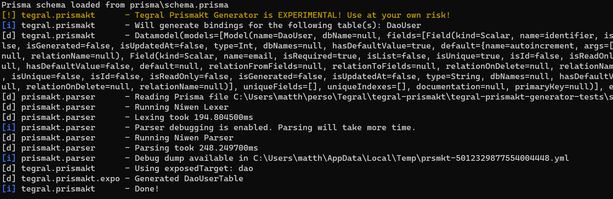

Long time no see! Welcome to the release notes for Tegral 0.0.4! This release introduces a Prisma generator, a new parsing and lexing framework and much more!

<!-- truncate -->


## Experimental: Tegral PrismaKT

Tegral PrismaKT is a new module that allows you to create [JetBrains Exposed](https://github.com/jetbrains/exposed) tables and entities from your [Prisma](https://prisma.io) schema!

This allows you to use the powerful Prisma toolkit with your Kotlin projects, and is an exciting first step towards integrating data-layer solutions to Tegral Web.



This is very much a work in progress, but most of the technical base has been implemented. We'll be able to move quite fast and add all kinds of features to this new module. Check [this issue](https://github.com/utybo/Tegral/issues/81) for more information!

## Tegral Niwen

Tegral Niwen is a parsing and lexing framework with a focus on ease of use and ability to quickly prototype stuff.

```kotlin
// ------ Lexer

enum class Tokens {
    NUMBER,
    PLUS
}

val lexer = niwenLexer {
    state {
        matches("[\\d+]") isToken Tokens.NUMBER
        '+' isToken Tokens.PLUS
        ' '.ignore
    }
}

// ------ Parser

data class PNumber(val value: Int) {
    companion object : ParserNodeDeclaration<PNumber> by reflective()
}

data class PSum(val left: PNumber, val right: PNumber) {
    companion object : ParserNodeDeclaration<PSum> by reflective()
}

val parser = niwenParser {
    PSum root {
        expect(PNumber) storeIn PNumber::left
        expect(Tokens.PLUS)
        expect(PNumber) storeIn PNumber::right
    }

    PNumber {
        expect(Tokens.NUMBER) transform { it.toInt() } storeIn PNumber::value
    }
}

parser.parse(lexer.tokenize("1 + 2"))
// == PSum(PNumber(1), PNumber(2))
```

Tegral Niwen is the evolution of [Pangoro](https://github.com/utybo/Pangoro) and [Lixy](https://github.com/utybo/Lixy), two of my previous personal projects. Niwen is signficiantly better in several ways (such as better documentation, better type-safety in the parser, better error handling, etc.) and is also much more flexible.

PrismaKT actually uses it under the hood to re-parse your Prisma schema for more accurate typing!

## Optional configuration in Tegral Web

When using Tegral Web, you previously had to always specify a configuration file. This is no longer required, as Tegral Web will now use a default configuration if none is provided. This default configuration is to use port 8080 and bind against `0.0.0.0`.

## Experimental: Fundefs in Tegral DI

Fundefs allow you to define components as functions. Previously, you could only define components as classes that use properties to inject dependencies. Fundefs lift this restriction and allow you to use regular function parameters as injected things. Here's a simple example:

```kotlin
class Greeter {
    fun greet(name: String) = "Hello, $name!"
}

fun greetAlice(greeter: Greeter): String {
    return greeter.greet("Alice")
}

val env = tegralDi {
    put(::Greeter)
    putFundef(::greetAlice)
}

val fundef = env.getFundefOf(::greetAlice)
val result = fundef.invoke()
// result == "Hello, Alice!"
```

You may not immediately see the usefulness of this, as this is a somewhat limited way of grabbing dependencies, but this will be extremely useful for Tegral Web Controllers. The end goal is to have a syntax that looks like this:

```kotlin
class Greeter {
    fun greet(name: String) = "Hello, $name!"
}

fun Routing.hello(greeter: Greeter) {
    get("/hello") {
        call.respondText(greeter.greet("Alice"))
    }
}

fun Application.myModule(/* ... */) {
  // ...
}

fun main() {
    tegral {
        put(::Greeter)
        put(Routing::hello)
        put(Application::myModule)
    }
}
```

Not only is this more concise, this is also much closer to Ktor's "module" concept, making it less confusing for those who are familiar with Ktor. This is _not_ fully done yet, we're about a third of the way there. You can check out [this issue](https://github.com/utybo/Tegral/issues/65) to follow how it's going.

## Tegral OpenAPI improvement

### Set common operation properties in OpenAPI paths

That title probably does not make any sense, so let's dig in a little:

OpenAPI documents are made of paths (e.g. `/foo/bar`), which themselves contain operations (e.g. `GET`, which would make `GET /foo/bar`).

Previously, you could only define operation attributes (descriptions, responses, headers, etc.) on the operation. That ended up being somewhat cumbersome as all operations in a single path tend to have some similar details (e.g. two operations under `/cat/{id}` will both have information on the `id` parameter).

Moreover, as a @Ribesg pointed out [in a GitHub issue](https://github.com/utybo/Tegral/issues/59), that ended up making things like properly defining multiple operations on a single Ktor resource impossible. More specifically, Ktor resources provide an _operation_ description while they actually really only represent _paths_. That meant that you could not define multiple descriptions for the same resource.

You can now define properties that should be present on all operations of a path directly in the path. For example:

```kotlin
// Before
"/cat/{id}" {
    get {
        description = "Get the cat with the given ID"

        "id" pathParameter {
            description = "The ID of the cat"
            // ...
        }
    }

    put {
        description = "Update the cat with the given ID"

        "id" pathParameter {
            description = "The ID of the cat"
            // ...
        }
    }

    // ...
}

// After
"/cat/{id}" {
    "id" pathParameter {
        "The ID of the cat"
    }

    get {
        description = "Get the cat with the given ID"
    }

    put {
        description = "Update the cat with the given ID"
    }

    // ...
}
```

`describeResource` now accepts a `PathDsl` instead of an `OperationDsl`, and you can now do things like this:

```kotlin
@Serializable @Resource("/cat/{id}")
class Cat(val id: Long) {
    companion object : OpenApiDescription by describeResource({
        "id" pathParameter {
            description = "The ID of the cat"
        }

        get {
            description = "Get the cat with the given ID"
        }

        put {
            description = "Update the cat with the given ID"
        }
    })
}
```

### Cascading OpenAPI descriptions for Ktor resources

Ktor resources' descriptions will now _cascade_. Anything defined at the path level of an outer resource will be replicated in the inner resource, e.g.:

```kotlin
@Resource("/cat") @Serializable
class Cat {
    companion object : ResourceDescription by describeResource({
        tags += "cat-api"
    })

    @Resource("/{id}") @Serializable
    class WithId(val id: Int) {
        companion object : ResourceDescription by describeResource({
            // Inherits the tags += "cat-api"
            "id" pathParameter {
                description = "The ID of the thing"
            }
        })
    }

    @Resource("/owner")
    @Serializable
    class OwnerDetails(val parent: WithId) {
        companion object : ResourceDescription by describeResource({
            // Inherits the tags += "cat-api" as well as the "id" path parameter
            get {
                summary = "Retrieve the owner details of the cat"
            }
        })
    }
}
```

## Updated dependencies

We have a few updated dependencies in this release, but most importantly **Ktor was updated to verison 2.3.0** from version 2.1.x, and version 2.2.0 introduced some breaking changes. Refer to [their migration guide](https://ktor.io/docs/migrating-2-2.html) if you use:

- Cookie response configuration
- `call.request.origin.host` or `port`
- Persistence w.r.t. caching in Ktor Client

Here's the full list of upgrades:

| Dependency        | Version change   |
| ----------------- | ---------------- |
| Clikt             | 3.5.0 -> 3.5.2   |
| Hoplite           | 2.5.2 -> 2.7.4   |
| Jackson           | 2.13.1 -> 2.15.0 |
| JUnit             | 5.9.0 -> 5.9.2   |
| Kotlin            | 1.7.10 -> 1.8.21 |
| Kotlin Coroutines | 1.6.4 -> 1.7.1   |
| Ktor              | 2.1.0 -> 2.3.0   |
| Logback           | 1.2.11 -> 1.4.5  |
| MockK             | 1.12.5 -> 1.13.4 |
| SLF4J             | 1.7.36 -> 2.0.7  |
| Swagger Core      | 2.2.2 -> 2.2.9   |
| Swagger UI        | 4.13.2 -> 4.15.5 |

## Misc. changes

Here are smaller, miscellaneous changes.

### Tegral Config: Fully optional sectioned configuration

Tegral Config's sectioned configurations are now fully optional if **all** of the defined sections are optional.

### Tegral OpenAPI: Add headers in responses

It's in the spec but I forgot to add it, woopsies. This has been fixed and you can use `"Hello" header { }` in your responses!
