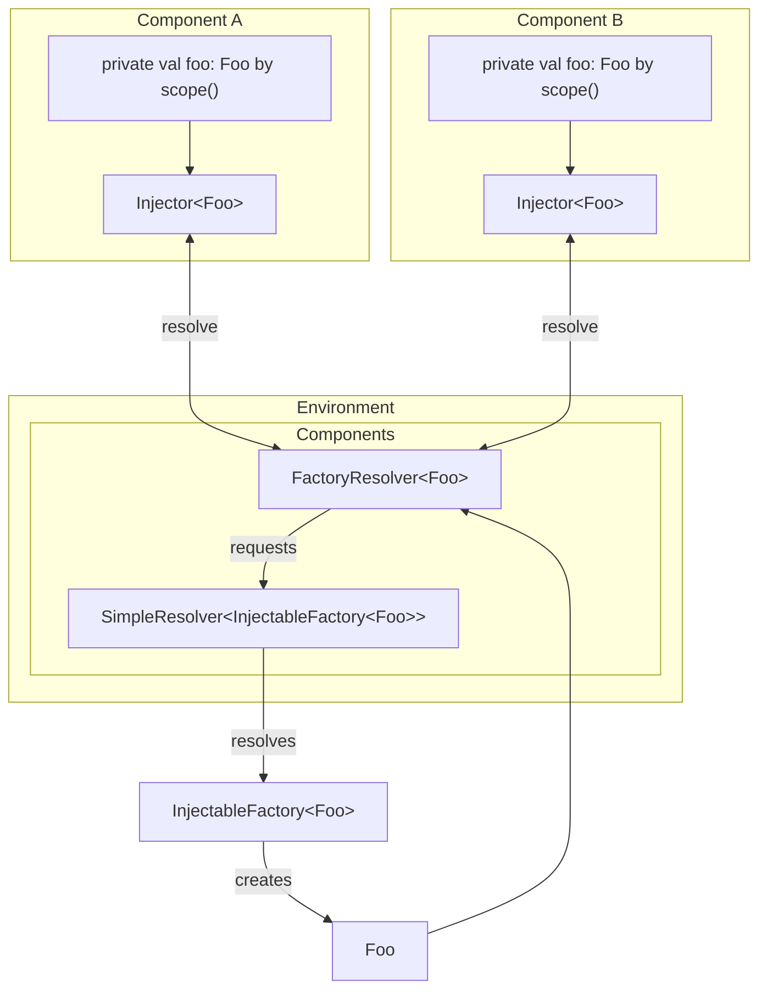

# Factories

*This is a pure extension that is compatible with all environments.*

Many frameworks allow you to inject two kinds of components:

- *Singletons*, where a single object instance is injected wherever needed
- *Factories* (also known as transient), where any component that depends on it gets its own instance of the object.

Factories are very useful for objects like loggers or to get more advanced behavior depending on the requesting component.

By default, components `put` in a Tegral DI environment are resolved as singletons. The Factories extension allows you to create factories in Tegral DI, which will create a new object each time the an object is requested.

## Usage

You can create factories using the `putFactory` method within your environment builder or within a module.

```kotlin
val myModule = tegralDiModule {
    putFactory { Foo() }
}

val myEnvironment = tegralDi {
    putFactory { Bar() }
}
```

Factories are injected using the regular `scope()` syntax. For example, requesting the `Bar` factory will look like this:

```kotlin
class INeedBar(scope: InjectionScope) {
    val bar: Bar by scope()
}
```

Here is a full example using loggers:

```kotlin
class Logger {
    fun logInfo(message: String) = println("INFO: $message")
    fun logWarn(message: String) = println("WARN: $message")
}

class ServiceA(scope: InjectionScope) {
    private val logger: Logger by scope()

    fun doSomething() {
        logger.logInfo("Doing something in A...")
    }
}

class ServiceB(scope: InjectionScope) {
    private val logger: Logger by scope()
    private val a: ServiceA by scope()

    fun doSomething() {
        a.doSomething()
        logger.logInfo("Doing something in B...")
    }
}

val environment = tegralDi {
    putFactory { Logger() }

    put(::ServiceA)
    put(::ServiceB)
}

environment.get<ServiceA>().doSomething()
// INFO: Doing something in A...
// INFO: Doing something in B...
```

### Requestor-dependent object creation

It is possible to create objects based on which component is requesting them. The `putFactory` block gives the requesting object as a parameter, which can then use to do anything.

This is useful for giving a logger a name, for example:

```kotlin
class Logger(private val name: String) {
    fun logInfo(message: String) = println("($name) INFO: $message")
    fun logWarn(message: String) = println("($name) WARN: $message")
}

// ServiceA and ServiceB are the same as before

val environment = tegralDi {
    putFactory { requester -> Logger(requester::class.qualifiedName ?: "<anon>") }

    put(::ServiceA)
    put(::ServiceB)
}

environment.get<ServiceA>().doSomething()
// (org.example.ServiceA) INFO: Doing something in A...
// (org.example.ServiceB) INFO: Doing something in B...
```

You can go even further with annotations. Here's a fuller example that uses annotations to name loggers, with an additional fallback mechanism:

```kotlin
// The annotation's definition
@Target(AnnotationTarget.CLASS)
@Retention(AnnotationRetention.RUNTIME)
annotation class LoggerName(val name: String)

// Reflection logic used to retrieve the name the logger of a class.
private val KClass<*>.loggerName: String
    get() = findAnnotation<LoggerName>()?.name ?: qualifiedName ?: "<anon>"

// Our actual Logger object: nothing really special here...
class Logger(private val name: String) {
    fun logInfo(message: String) = println("($name) INFO: $message")
    fun logWarn(message: String) = println("($name) WARN: $message")
}

// Let's give ServiceA a custom name...
@LoggerName("Custom logger name!")
class ServiceA(scope: InjectionScope) {
    private val logger by scope()

    fun doSomething() {
        logger.logInfo("Doing something in A...")
    }
}

// ... but let's also leave ServiceB as is.
class ServiceB(scope: InjectionScope) {
    private val logger by scope()
    private val a by scope()

    fun doSomething() {
        a.doSomething()
        logger.logInfo("Doing something in B...")
    }
}

// Let's now create our environment:
val environment = tegralDi {
    putFactory { requester -> Logger(requester::class.loggerName) }

    put(::ServiceA)
    put(::ServiceB)
}

// And test our logger:
environment.get<ServiceA>().doSomething()
// (Custom logger name!) INFO: Doing something in A...
// (org.example.ServiceB) INFO: Doing something in B...
```

## Factories under the hood

It may help to first read a bit about [Tegral DI's internals](../internals.md) to better understand this part.

When you use `putFactory`, two declarations are created:

- A regular `put`-like declaration for an `InjectableFactory`. This object wraps the labmda you pass to `putFactory`.
- A *resolvable* declaration mapped against the type of objects created by your factory. The associated resolver is a `FactoryResolver` which will, when resolved, retrieve the `InjectableFactory` and create an object from it, then return it.

If you were creating a factory of `Foo` objects:

- The first declaration would be for the `InjectableFactory<Foo>` object (identifier with `InjectableFactory::class` and a [`typed<Foo>()`](../qualifiers.md#typed) qualifier).
- The second declaration would be for the `Foo` object (identifier with `Foo::class` and no qualifier).

Thus, when requesting a `Foo` object, you will hit the `FactoryResolver`, which will automatically grab the `InjectableFactory`, create an object from it and return it.

Here's an overview of the process. Note that `Component A` and `Component B` will each get their own instance of `Foo`.


