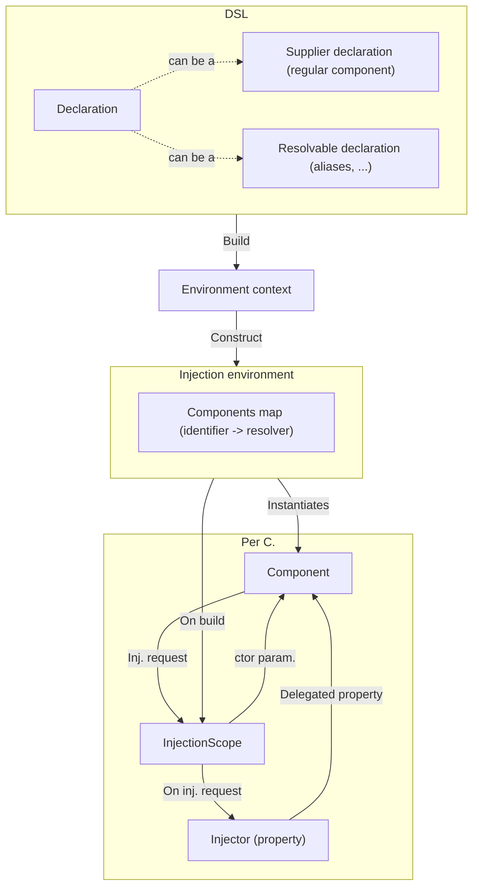
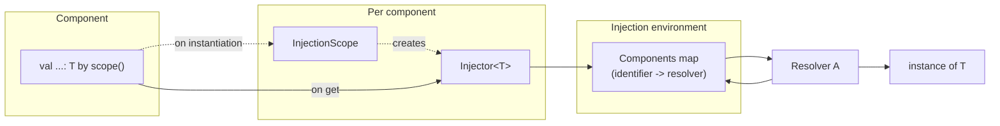

# DI Internals

Tegral DI is a fairly complex piece of software. This page documents some of the internals of Tegral DI so that you can better understand what is happening and where.

## Overview

Here is a general overview of Tegral DI. Note that, right away, there are two "worlds" at play: the DSL world and the environment world. This is to cleanly separate the DSL builders from the actual working parts. The object used to communicate what should be contained in an environment is the *environment context*.

Note that the following graph is simplified:

- Extensible injection environments embed another environment for storing meta-components, see [here](./extensions/introduction.md#extensions-behind-the-scenes) for details.

(Per C. = Per Component)

## Injections under the hood

Injections follow this pattern:

- On instantiation, the component calls `by scope()`, which makes the `InjectionScope` request an `Injector` from the injection environment.
- When getting the value of the property
  - The `Injector` that was returned previously asks the injection environment for an actual value.
  - The injection environment will retrieve a resolver from its internal components map using the requested identifier.
  - The resolver *resolves*, meaning that it gets an actual instance of the requested object. The actual meaning of "getting an instance" is implementation specific:
    - For simple components, it just returns the instance of the component
    - For aliases, it will ask the components map back for the aliased resolver, and resolve that one instead.

This process is slightly different for each type of environment. Most environments will only do this process once and store the instance at the injector.

- If an environment only performs this process once...
  - ... and it is done right away when the environment is created, it is said to perform **eager injections**.
  - ... and it is done on the first `get` on the property, it is said to perform **lazy injections**.
- If an environment performs this process every time, it is said to perform **active injections**.

If cached, the instance of `T` ends up stored in (or at least referenced by) the `Injector`.

The various properties of a given environment are given in its KDoc comment.

## Resolvers

Environments map identifiers to *resolvers* instead of directly mapping identifiers to resolvers. When an injection of a given identifier is requested, the relevant resolver is found and its *resolve* function gets called. This process is done once per injection (e.g. if 3 components require a "Foo" identifier, the Foo resolver will be resolved 3 times in total).

When resolving, resolvers have access to:

- The requester. In the case of a `by scope()` injection, this is the component that requested the injection. In the case of `get/getOrNull` function calls on the environment, this is null.
- All of the components in the environment. This map can be used to find other resolvers and "redirect" onto them.

Some resolvers are considered *canonical*. The rule of thumb is that canonical resolvers embed an actual "singleton" object instance, instead of being a "redirection" to another resolver or a "dynamic supplier".

Resolvers can range from returning a predetermined instance to having more
advanced behavior. Here are examples of built-in resolvers:

| Class name | Description |
|------------|-------------|
| `SimpleIdentifierResolver` | Returns a predetermined object instance. Canonical. |
| `AliasIdentifierResolver`  | Queries the components for another identifier, and resolves that identifier instead. |
| `FactoryResolver`          | Retrieves the corresponding `InjectableFactory` from the components, and uses it to create a separate instance for each resolution. |
