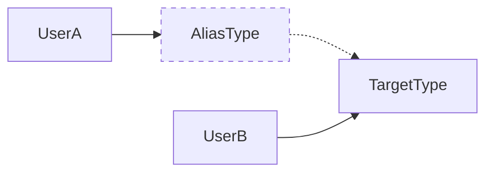

# Aliases

It is possible to add *aliases* to your environment.

Aliases allow you to point to an existing declaration in a different way.

## Syntax

Similarly to regular `put` calls, adding an alias can be done using an inline-reified approach or a `KClass`-based approach.

```kotlin
interface AliasType
class TargetType : AliasType

val env = tegralDi {
    put(::TargetType)

    // Using reified types (you can read this as 'AliasType --> TargetType')
    putAlias<AliasType, TargetType>()

    // Using KClass objects
    putAlias(aliasClass = AliasType::class, targetClass = TargetType::class)
}
```

In this case, our environment will only have a single component `TargetType`, and an additional alias `AliasType` pointing to it.

This allows us to retrieve the same component using two different identifiers:

```kotlin
class UserA(scope: InjectionScope) {
    private val targetType: TargetType by scope()
}

class UserB(scope: InjectionScope) {
    private val aliasType: AliasType by scope()
}
```



Although we are retrieving an object with two different identifiers, it *is* the same object:

```kotlin
class Checker(scope: InjectionScope) {
    private val targetType: TargetType by scope()
    private val aliasType: AliasType by scope()

    fun check() {
        if (targetType === aliasType) {
            println("They are the same object!")
        } else {
            println("Not the same object!")
        }
    }
}

val env = tegralDi {
    put(::TargetType)
    putAlias<AliasType, TargetType>()
    put(::Checker)
}

env.get<Checker>().check() // "They are the same object!"
```

### Qualifiers

You can also use qualifiers to further specify the identifiers. There are two (sets of) qualifiers you can define:

- The qualifiers for the alias, i.e. the qualifiers that will be used when you want to use the alias.
- The qualifiers for the target, i.e. the qualifiers that the alias will use to find the actual object to use.

The syntax is as follows:

```kotlin
val env = tegralDi {
    put(::Component)
    put(named("myTarget"), ::TargetType)

    // Using reified types (you can read this as 'AliasType --> TargetType')
    putAlias<AliasType, TargetType>(aliasQualifier = named("myAlias"), targetQualifier = named("myTarget"))

    // Using KClass objects
    putAlias(
        aliasClass = AliasType::class,
        aliasQualifier = named("myAlias"),
        targetClass = TargetType::class,
        targetQualifier = named("myTarget")
    )
}

class Component(scope: InjectionScope) {
    private val directlyUsingTarget: TargetType by scope(named("myTarget"))
    private val usingAlias: AliasType by scope(named("myAlias"))
}
```

## Examples

There are a few possible use-cases for aliases.

### Expose a contract and its implementation

For example, say we have the following class and interface:

```kotlin
interface Say {
    fun saySomething()
}

class SayHello : Say {
    override fun saySomething() {
        println("Hello!")
    }
}
```

Now, let's say we have the two following components:

```kotlin
class ComponentA(scope: InjectionScope) {
    private val say: Say by scope()
    
    // ..
}

class ComponentB(scope: InjectionScope) {
    private val sayHello: SayHello by scope()

    // ...
}
```

Aliases can help us achieve this pattern like so:

```kotlin
val env = tegralDi {
    put(::SayHello)
    putAlias<Say, SayHello>()
    put(::ComponentA)
    put(::ComponentB)
}
```

### Use different qualifiers for the same object

If, for whatever reason, you need to expose the same object under different qualifiers, you can use aliases for this.

Let's say that we want to expose a string both without qualifiers and with a named qualifier. You could do it like so:

```kotlin
val env = tegralDi {
    put { "abcdef" }
    put<String, String>(aliasQualifier = named("alphabet"))
}

println(env.get<String>()) // "abcdef"
println(env.get<String>(named("alphabet"))) // "abcdef"
```
