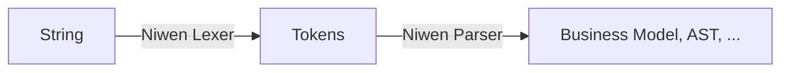
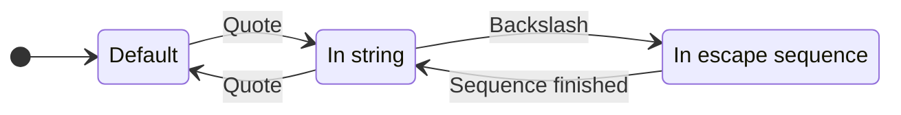

import PackageVersions from '@site/src/components/PackageVersions';

# Tegral Niwen

Tegral Niwen is a framework for building lexers and parsers, with a large focus on ease of use. This project was formerly known as [Lixy](https://github.com/utybo/Lixy) (for the lexer part) and [Pangoro](https://github.com/utybo/Pangoro) (for the parser part), see [here](#differences-with-lixy-and-pangoro) for more information.

Tegral Niwen is subdivided into two separate libraries:

- [Tegral Niwen Lexer](lexer.md), a framework for building lexers
- [Tegral Niwen Parser](parser.md), a framework for building parsers



You'll often need both, but are provided as separate dependencies just in case.

<PackageVersions libraries={[
    { name: 'tegral-niwen-lexer', catalog: 'niwen.lexer' },
    { name: 'tegral-niwen-parser', catalog: 'niwen.parser' }
]}/>

## Introduction

Here's a simple example of a parser written using Tegral Niwen for documents that contain a list of sums, like this:

```text
1 + 2

   33       +     44
```

We'll first define the model our parser will output. This can be seen as an AST, but what it actually is will depend on what you're trying to achieve.

```kotlin
data class Sum(val left: Number, val right: Number) {
    companion object : ParserNodeDeclaration<Sum> by reflective()
}

data class Number(val value: Int) {
    companion object : ParserNodeDeclaration<Number> by reflective()
}

data class SumsDocument(val sums: List<Sum>) {
    companion object : ParserNodeDeclaration<SumsDocument> by reflective()
}
```

Then, we'll define our *lexer tokens*. These represent the *lexemes* of what you're trying to parse, i.e. the simplest, abstractiest "particles" of your language. You'll usually have tokens for strings, numbers, for each operator, etc. They significantly simplify the parsing process but getting the exact details of "what character is that" out of the way.

Tegral Niwen Lexer's lexers are built using the `niwenLexer` function. When defining our lexer, we use *recognizers* and *actions*. Recognizers recognize a sequence of characters and, if true, "match" and execute the actions. Actions can be to ignore the current character sequence, emit a token, etc.

Here's our lexer:

```kotlin
enum class Tokens : TokenType {
    NUMBER,
    PLUS,
    NEWLINE
}

val lexer = niwenLexer {
    state {
        matches("\\d+") isToken Tokens.NUMBER
        '+' isToken Tokens.PLUS
        '\n'.repeated isToken Tokens.NEWLINE
        ' '.ignore
    }
}
```

:::note What's this `state` thing?

Niwen lexers are actually *multi-state* lexers. This means that you can define and switch between different states within your lexer. This can be useful if you're trying to parse a language that has different "modes", e.g. a language that has both a "code" mode and a "string" mode:



:::

Finally, we'll define our parser.

```kotlin
val parser = niwenParser<SumsDocument> {
    SumsDocument root {
        repeated {
            expect(Sum) storeIn item
        } storeIn SumsDocument::sums
    }

    Sum {
        expect(Number) storeIn Sum::left
        expect(Tokens.PLUS)
        expect(Number) storeIn Sum::right
        either {
            expect(Tokens.NEWLINE)
        } or {
            expectEof()
        }
    }

    Number {
        expect(Tokens.NUMBER) transform { it.toInt() } storeIn Number::value
    }
}
```

And use our lexer and parser to parse something!

```kotlin
// We'll first call tokenize on our lexer to get the tokens...
val tokens = lexer.tokenize(
    """
    1 + 2
    33     +       44


    555+666
    """.trimIndent()
)
// ...then call parse on the parser to get our final result!
val result = parser.parse(tokens)
/*
 * SumsDocument(
 *   sums=[
 *     Sum(left=Number(value=1), right=Number(value=2)),
 *     Sum(left=Number(value=33), right=Number(value=44)),
 *     Sum(left=Number(value=555), right=Number(value=666))
 *   ]
 * )
 */
```

Now, this example is obviously not the best use case for something like Tegral Niwen, as you could easily manually create a lexer/parser for this language. But the main idea here is that you can easily scale your parser/lexer *up* from here and build even more features into your language!

Want to find out more? Click [here for more information on lexers](lexer.md) or [here for more information on parsers](parser.md)

## Side note: philosophy and background

You may already know quite a few tools for building lexers and parsers, such as [ANTLR](https://www.antlr.org/) or [JFlex](https://jflex.de/). So, why should you use Tegral Niwen?

The truth is that [I](https://github.com/utybo) made Tegral Niwen because I wanted to have a lexer/parser framework that was intuitive, easy to reason about and allowed me to create small projects, putting things like performance to the background.

This means that Tegral Niwen is explicitly **not** built for the absolute best performance. It is primarily designed to be easy to use, and that is often at odds with performance. Or at least, in this case, it kind of is.

I'd recommend using Tegral Niwen either for simple projects, prototyping or for situations where you can live with not having the best performance for your project. And once you do need that performance, you could always switch to a more performant tool -- Niwen is not holding you hostage and, thanks to its easy to understand DSL, it should be easy to reread your own model and translate it to another tool.

## Lexers and parsers 101

Confused about what this is all about? Here's a tl;dr.

From a very abstract perspective, when we think of parsing things, what we really want to do is turn a string of character into some useful model of our choice.

Compilation of programming languages is an example of something like this: compilers take in files (which are inherently strings of characters) and output some form of executable format.[^1]

[^1]: This is a big simplification of the process that goes into the compilation of programming languages. Parsing, as in looking at the file and extracting its structure into an *abstract syntax tree*, is usually the first step of this process.

**Lexers** and **parsers** are two categories of tools that you can use to perform this process.

Say, for example, we wanted to parse some imaginary culinary language which you could use to create some cookbook:

```text
recipe "plainPasta" {
    description = "Just some plain pasta"
    difficulty = "easy"
    timeMinutes = 10
}

recipe "pastaWithCheese" {
    description = "Doesn't get much easier";
    difficulty = "easy";
    timeMinutes = 12;
}
```

Say we wanted to *parse* this cookbook into the following model:

```kotlin
data class Cookbook(val recipes: List<Recipe>)

data class Recipe(
    val name: String,
    val properties: Map<String, String> // contains descriptions, difficulty, etc.
)
```

We can first create a *lexer* to turn the original string into a sequence of tokens. This is a very basic step: the idea here is to just get the very basic "words" and symbols of our language, so that our parser can focus on putting these tokens together and not worry about each individual character of the input string:

```text
Input string                  Token type        Token value
-------------------------     ---------------   ----------------
recipe                    --> IDENTIFIER        recipe
"                         --> QUOTE             "
plainPasta                --> STRING_CONTENT    plainPasta
"                         --> QUOTE             ""
{                         --> OPEN_BRACE        {
description               --> IDENTIFIER        description
=                         --> EQUALS            =
"                         --> QUOTE             "
Doesn't get much easier   --> STRING_CONTENT    Doesn't get much easier
"                         --> QUOTE             ""
;                         --> SEMICOLON         ;
...                              ...                   ...
}                         --> CLOSE_BRACE       }
```

It may not look like it at first, but these tokens are *much* easier to reason about.

As for our parser, we'll reflect Tegral Niwen's philosophy here and use an "expectation"-style parser. Specifically, we'll use a parser that just describes what each one of its nodes is supposed to contain. For example, let's take the following definition, where things in **bold** are models we want to describe, and things in *italics* are tokens we retrieved as part of our lexer.

- **Cookbook**
  - A list of **recipes**
- **Recipe**
  - An *identifier* with value `recipe`.
  - A **string**, which we'll store in the recipe's `name`.
  - An *open brace*
  - A list of **properties**
  - A *close brace*
- **Property**
  - An *identifier*, which we'll store in the property's `key`.
  - An *equals* sign
  - A **string**, which we'll store in the property's `value`.
  - A *semicolon*
- **String**
  - A *quote*
  - A *string content*, which we'll store as the string's `value`.
  - A *quote*

This example is obviously simplified and does not take all the possible edge cases into account, but it should give you a good idea of what our parser may look like.

With this given lexer and parser, we can now parse our cookbook into a proper model.

*Tegral Niwen* allows you to create a lexer and a parser using simple definitions that are close to what we used in the example here.

## Differences with Lixy and Pangoro

Tegral Niwen Lexer and Parser have several differences compared to their original libraries, respectively Lixy and Pangoro:

### Kotlin Multiplatform support was removed

Kotlin Multiplatform Projects (MPP) support was removed. This allowed you to use Lixy/Pangoro with targets other than the JVM, such as Kotlin/JS or Kotlin/Native.

Tegral is currently a JVM-only project and I preferred focusing on the existing JVM target first. There are currently no plans for reintroducing MPP support, but that is not definitive, please [open an issue](https://github.com/utybo/Tegral) describing your use case if you'd like to see MPP support for Tegral Niwen.

### "Lixy" and "Pangoro" names dropped from class names

Almost all the classes from both Lixy and Pangoro had "Lixy" or "Pangoro" in their name. This was removed in Tegral Niwen to make the classes easier to deal with.

### PangoroNode interface was removed

The `PangoroNode` interface, which allowed you to mark parser nodes as such, is no longer required and has been removed. It was mostly useless, and this removal can allow you to create models that were not originally planned for Pangoro/Niwen.

### Type-safety in Pangoro's DSL

Pangoro's DSL now features type-safety with `storeIn` and the likes. This means that, instead of `storeIn "someField"`, you must now use `storeIn MyModel::someField`. Most of the internals were reworked around this change.

### Shorthand notations removed

Shorthand notations (aka "Pangoro, the unreadable version") were removed.
