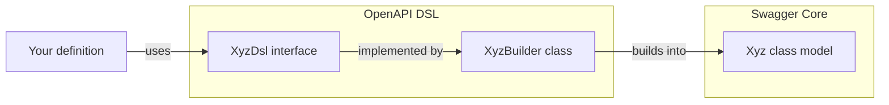

# DSL

`tegral-openapi-dsl` provides a Kotlin DSL, a "mini-language" within a language.

This DSL is a core "common language" that is ingested by other components of Tegral OpenAPI. This language covers most (but not all) features of the [OpenAPI specification](https://openapis.org).

Behind the scenes, the DSL is a facade over [Swagger Core](https://github.com/swagger-api/swagger-core), which provides models and [Jackson](https://github.com/FasterXML/jackson) serialization utilities.

## General organization

The DSL is organized as follows:



Your code will use DSL interfaces, which are implemented by builders, which will then be built into Swagger Core models.

## Entrypoints

The DSL provides a single entrypoint: the `openApi` function, within which you will have access to the [root DSL](#rootdsl). The `openApi` function returns an `OpenApi` object that contains everything you specified in the DSL. You can then use `.toJson()` or `.toYaml()` on the object to convert it to the desired string format.

```kotlin
val api = openApi {
    // see RootDsl
}
```

## DSL reference

### RootDsl

The Root DSL (`RootDsl`) allows you to define basic information on your API, and lets you dig deeper.

`RootDsl` also includes all the elements from `InfoDsl`, `TagsDsl`  and `PathsDsl`.

`RootDsl` will build an `OpenApi` object (i.e. the root object), which will have some nested fields initialized. For the sake of simpler code, the DSL has the content of the `info` object directly in the root.

You can refer to the KDoc comments to find out more about the various fields.

```kotlin
// Information (from InfoDsl)
title = "My API"
summary = "This is the summary of my API"
description = "This is the description of my API"
termsOfService = "https://example.com/..."
contactName = "John Doe"
contactUrl = "https://example.com/johndoe"
contactEmail = "johndoe@example.com"
licenseName = "Apache 2.0"
licenseIdentifier = "Apache-2.0" // or licenseUrl
licenseUrl = "https://www.apache.org/licenses/LICENSE-2.0.html" // or licenseIdentifier
version = "1.2.3"

// Tags (from TagsDsl)
"my-tag" tag {
    // see TagDsl
}

// Paths (from PathsDsl)
"/foo" {
    // see PathDsl
}

"/bar" get { // or post, put, delete, patch, options, head
    // see OperationDsl
}

// from RootDsl
"myScheme" securityScheme {
    // see SecuritySchemeDsl
}

"https://example.com" server {
    // see ServerDsl
}

externalDocsDescription = "These are te external docs"
externalDocsUrl = "https://example.com"
```

### TagDsl

`TagDsl` allows you to define a tag that can then be reused in various other fields. Tags can be seen as groups of endpoints.

```kotlin
description = "Description for my tag"
externalDocsDescription = "These are the external docs for my tag"
externalDocsUrl = "https://example.com"
```

### PathDsl

`PathDsl` allows you to define various operations under a path.

```kotlin
get { // or post, put, delete, patch, options, head
    // see OperationDsl
}
```

### OperationDsl

`OperationDsl` defines the various properties of an endpoint (an endpoint being a path + HTTP method).

```kotlin
summary = "This is the summary of my operation"
description = "This is the description of my operation"
externalDocsDescription = "These are the external docs for my operation"
externalDocsUrl = "https://example.com"
deprecated = false
operationId = "myOperation"
tags += "tagOne"


/* --- Parameters --- */
// 'parameters' is the list of parameters, but you should use the following
// functions to easily create some:
"myParam" pathParameter {
    // see ParameterDsl
}

"My-Header" headerParameter {
    // see ParameterDsl
}

"nameInCookie" cookieParameter {
    // see ParameterDsl
}

"queryParam" queryParameter {
    // see ParameterDsl
}

/* --- Request body --- */
// 'requestBody' allows you to directly set a builder, but you should use the
// following function instead:
body {
    // see RequestBodyDsl
}

/* --- Responses --- */
// 'responses' is a map of codes to responses, but you should use the following
// instead:
200 response {
    // see ResponseDsl
}

/* --- Security requirements --- */
// 'securityRequirements' is a list of security requirements (which are
// declared using RootDsl's 'securityScheme') that need to be matched in order
// to use this endpoint. While you can (and should) use the
// 'securityRequirements' list directly for more complex use-cases, you can
// also use the following functions for simpler ones:
security("securitySchemeName")
security("securitySchemeName", "scopeOne", "scopeTwo") // only for OAuth2
```

### SecuritySchemeDsl

```kotlin
description = "This is the description of my security scheme"

/* --- Type --- */
// While you can use the `type` field directly with an element of the
// `SecurityScheme.Type` enum, you should consider using any of the following,
// which are more legible.
httpType
apiKeyType
oauth2Type
openIdConnectType
mutualTlsType

/* --- API Keys only --- */
name = "apiKeyName"
// You can use 'inLocation' for the location of the API key, but you should
// consider using any of the following instead
inCookie
inHeader
inQuery

/* --- HTTP type only --- */
bearerFormat = "jwt"
scheme = "Bearer"

/* --- OpenID Connect type only --- */
openIdConnectUrl = "https://example.com"

/* --- OAuth2 type only --- */
// No proper DSL is provided for flows. You should use the OAuthFlows object
// directly.
flows = ...
```

### ServerDsl

The `ServerDsl` interface does not currently support any functionality. You can leave the block empty.

### ParameterDsl

The `ParameterDsl` interface allows you to create parameter objects.

The name and kind of the parameter are provided in the enclosing `"foo" barParameter {}` call.

Note that many of the parameters present here have complex default behaviors. Check the KDoc comments for more information.

```kotlin
description = "Description for my parameter"
required = false // or 'required()' to set to true.
deprecated = false
allowEmptyValue = false // Note: this is deprecated in the OpenAPI spec
style = Parameter.StyleEnum.MATRIX // or LABEL, FORM, SIMPLE, SPACEDELIMITED, PIPEDELIMITED, DEEPOBJECT
explode = false
allowReserved = false

schema<...>(...) // see the 'Schemas' section
```

### RequestBodyDsl

Defines the body users provide to the API within their request.

Includes all of the [body-related utilities](#bodies)

```kotlin
description = "Description of the request object"
required = false
```

### ResponseDsl

Defines the response.

Includes all of the [body-related utilities](#bodies)

```kotlin
description = "Description of the response"
```

### Bodies

When handling bodies that can handle multiple content types (e.g. JSON, XML...) with the DSL, you will have to use the body DSL to define the possible input/output format.

The `content` mutable list contains all the pairings of content types and [media types](#media-types). You can use it if you need ultra-precise output objects, but you should otherwise use the following functions:

```kotlin
// Define some content for a custom content type
"content/type" content {
    // see Media Type
}

// Define some content for a predefined content type
json {
    // see Media Type
}

// You can also combine multiple predefined content types...
(json or xml) {
    // see Media Type
}
```

Available predefined content types are:

| Name | Content type |
|:----:|-------------|
| `json` | `application/json` |
| `xml` | `application/xml` |
| `form` | `application/x-www-form-urlencoded` |
| `plainText` | `text/plain` |

You can also define your own predefined content types by defining an extension property over `PredefinedContentTypesDsl`, e.g.:

```kotlin
val PredefinedContentTypesDsl.myType get() = ContentType("my/type")
```

### Media types

Media types can be provided in a few places in the DSL. These media types contain a few things:

- A schema
- An example

:::note

Defining multiple examples is not currently supported.

:::

Schemas can be set in a few ways:

- By directly providing a `Schema<*>` object to the `schema` property. For example: `schema = StringSchema()`.

- By using the `schema` function a KType, e.g. `schema(typeOf<String>())`

- By using the `schema` function with a KType and an example, e.g. `schema(typeOf<String>(), "Hello!")`

- By using the `schema` function with generic parameters, e.g. `schema<String>()`

- By using the `schema` function with generic parameters and an example, e.g. `schema<String>("Hello!")`. Using this technique usually means that you can omit the generic parameter (as the compiler can infer it from the example you give it), like so: `schema("Hello!")`

If possible, you should use the `schema()` variations. These will always produce a "minimal" schema which only contains a reference to a schema component. This optimizes the resulting output model, as repeating schemas will only be defined once and referred to.
