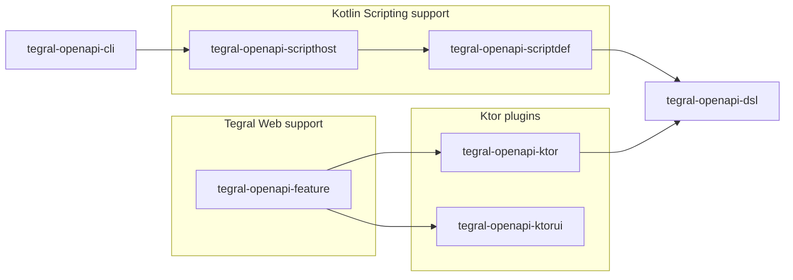

import PackageVersions from '@site/src/components/PackageVersions';

# Tegral OpenAPI

Tegral OpenAPI is a collection of libraries that allow you to:

- Create [OpenAPI](https://openapis.org) definitions using a [Kotlin DSL](./dsl.md).
- Define and parse [`*.openapi.kts` scripts](./scripting.md) that embed said DSL and convert them to JSON or YAML using a [CLI](./cli.md).
- Define [OpenAPI details of Ktor endpoints](./ktor.md#describing-endpoints) and serve [OpenAPI](./ktor.md#serving-the-openapi-file) and [Swagger](./ktor.md#tegralswaggeruiktor-installation) from Ktor applications.
- Integrate OpenAPI support in [Tegral Web](./tegral-web.md) applications.

Tegral OpenAPI provides a concise Kotlin syntax for (most of) your OpenAPI needs.

## Example

Here's an example of using the Tegral OpenAPI toolchain. Using `tegral-openapi-dsl` and `tegral-openapi-scriptdef`, we can write the following script file...

```kotlin title="myapi.openapi.kts"
title = "My API document"
version = "1.0.0"

"/hello" get {
    description = "Returns a greeting"
    200 response {
        plainText { schema("Hello World!") }
    }
}
```

... which we can then turn into a JSON or YAML file using `tegral-openapi-cli` and `tegral-openapi-scripthost`:

```bash
$ ./tegral-openapi-cli myapi.openapi.kts -f yaml -o myapi.yaml
[i] openapi.dump         - Compiling script...
[i] openapi.dump         - Evaluating script...
[i] openapi.dump         - Output written to myapi.yaml
```

... which gives us the following output:

```yaml
openapi: 3.0.1
info:
  title: My API document
  version: 1.0.0
paths:
  /hello:
    get:
      description: Returns a greeting
      responses:
        "200":
          description: A greeting
          content:
            text/plain:
              schema:
                type: string
              example: Hello World!
```

## Packages

<PackageVersions libraries={[
    { name: 'tegral-openapi-cli', catalog: 'openapi.cli' },
    { name: 'tegral-openapi-dsl', catalog: 'openapi.dsl' },
    { name: 'tegral-openapi-feature', catalog: 'openapi.feature' },
    { name: 'tegral-openapi-ktor', catalog: 'openapi.ktor' },
    { name: 'tegral-openapi-ktorui', catalog: 'openapi.ktorui' },
    { name: 'tegral-openapi-scriptdef', catalog: 'openapi.scriptdef' },
    { name: 'tegral-openapi-scripthost', catalog: 'openapi.scripthost' },
]}/>

### Hierarchy


