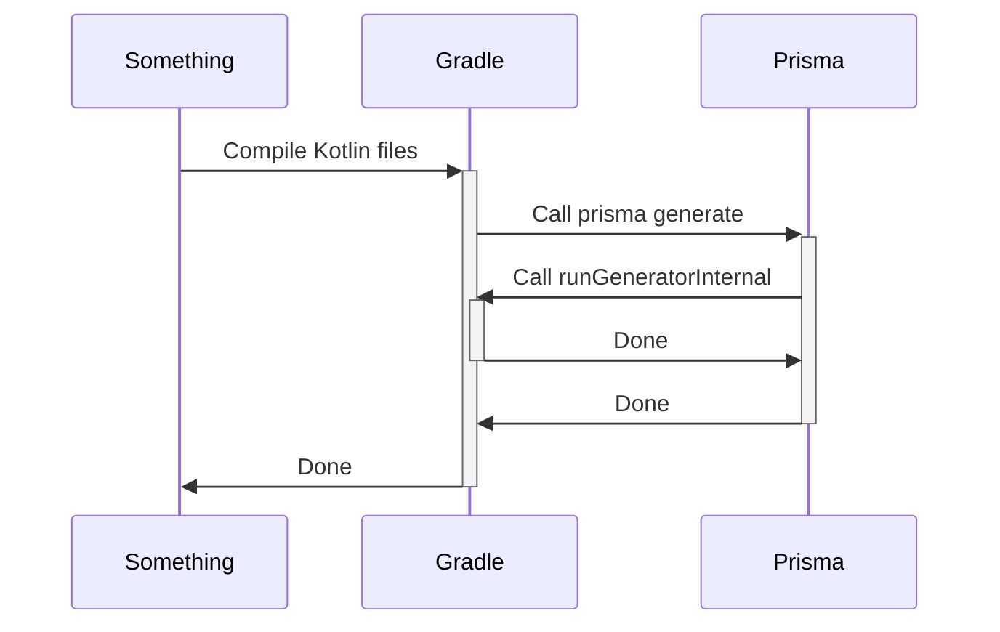
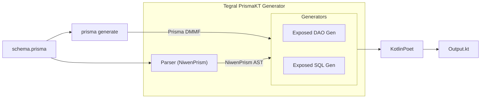

#  Tegral PrismaKT

:::caution

Tegral PrismaKT is **experimental** and not ready for production use. Please follow [this issue](https://github.com/utybo/Tegral/issues/81) for more information.

:::

PrismaKT is a tool that allows you to generate [JetBrains Exposed](https://github.com/jetbrains/Exposed) boilerplate code that matches your [Prisma schema](https://github.com).

It can:

- ✅ Generate tables ([SQL DSL API](https://github.com/JetBrains/Exposed/wiki/DSL)) from a Prisma schema
- ✅ Generate entities ([DAO API](https://github.com/JetBrains/Exposed/wiki/DAO)) from a Prisma schema
- ✅ Generate accurate columns for most `@db.Xyz` fields
- ✅ Manually parse Schema files using [Tegral Niwen](../niwen/index.mdx)

It currently **does not/cannot:**

- ❌\* Generate relations
- ❌\* Generate multi-column `@@id` fields.
- ❌\* Generate `JSON` fields
- ❌\* Automatically generate `Database.connect` calls
- ❌\* Have built-in integration with Tegral DI or Tegral Web

\* These features are planned but are not currently available due to PrismaKT's experimental status. Follow [this issue](https://github.com/utybo/Tegral/issues/81) for details.

If you find more limitations (or other things you want to see), feel free to [open an issue](https://github.com/utybo/Tegral/issues)!

## Setting up: with JBang

This is the easiest and fastest way of running Tegral PrismaKT, because it does not require changing many things in your Gradle configuration and does not require ping-ponging between Prisma and Gradle.

However, this is not the best way of using Tegral PrismaKT in a real appliaction, as using proper Gradle integrations will help make the development process less painful (i.e. re-running prisma generate when needing, ensuring models are generated before compiling, etc.).

Add the following to your `build.gradle` file:

```groovy
// Use the generated Kotlin files when compiling
sourceSets {
    main {
        kotlin {
            // Change this to wherever you'll put the generated files
            srcDir layout.buildDirectory.dir("prismaGeneratedSrc")
        }
    }
}
```

And the following to your `schema.prisma` file:

```prisma
generator prismakt {
  provider      =  "jbang --quiet guru.zoroark.tegral:tegral-prismakt-generator:0.0.4-SNAPSHOT"
  output        = "../build/prismaGeneratedSrc" // or wherever you want
  exposedTarget = "sql"
}
```

## Setting up: with Gradle

:::caution

You'll need a bit of experience with Gradle to successfully set this up. We're working on making things easier for you, but don't hesitate to [open an issue](https://github.com/utybo/Tegral/issues) if you need help!

:::

This part will focus on creating a two-way integration between Gradle and Prisma:



In a nutshell, we'll set Prisma to use Gradle to generate the code, and Gradle to call Prisma when we need to compile Kotlin code.

### Gradle setup

Assuming the following project structure:

```text
my-project
+-- app
|   +-- prisma/
|   |   +-- schema.prisma
|   +-- src/...
|   +-- build.gradle
+-- settings.gradle
```

In your `app/build.gradle` file, add the following:

```groovy
plugins {
    // Plugin for integration of npx/npm/etc in Gradle
    id "com.github.node-gradle.node" version "4.0.0"
}

configurations {
    generator
}

dependencies {
    // Put your Tegral PrismaKT dependency here, with Tegral Catalog
    generator tegralLibs.prismakt.generator
    // or without Tegral Catalog (replace VERSION with the version you want)
    generator "guru.zoroark.tegral:tegral-prismakt-generator:VERSION"
}

// Set up for running the generator

tasks.register('runGeneratorInternal', JavaExec) {
    mainClass = "guru.zoroark.tegral.prismakt.generator.MainKt"
    classpath = configurations.generator
    standardInput = System.in

    // This forces Gradle to always rerun the generator no matter what when Prisma launches it
    outputs.upToDateWhen { false }
}

// Set up for letting Gradle call 'prisma generate' and take its results into account
sourceSets {
    main {
        kotlin {
            srcDir layout.buildDirectory.dir("prismaGeneratedSrc")
        }
    }
}

tasks.compileKotlin.dependsOn prismaGenerate
tasks.compileTestKotlin.dependsOn prismaGenerate

tasks.register('prismaGenerate', NpxTask) {
    command = "prisma"
    args = ["generate"]

    inputs.file("prisma/schema.prisma")
    inputs.files(configurations.generator)
    outputs.dir(project.layout.buildDirectory.dir("prismakt-generator"))
}
```

### Prisma setup

In your `prisma/schema.prisma` file, add (or replace the current generator with) the PrismaKT generator:

```prisma
generator prismakt {
  provider      = "gradle --console=plain -q runGeneratorInternal"
  output        = "../build/prismaGeneratedSrc"
  exposedTarget = "sql"
}
```

If you want Tegral to generate DAO bindings, use `exposedTarget = "dao"`, otherwise use `exposedTarget = "sql"`

### Testing things out

You should now be able to run PrismaKT, either by running `prisma generate` (when using JBang) or `gradle prismaGenerate` (when using Gradle).

If everything goes well, you should see a `prismaGeneratedSrc` folder appear in your `build` folder, containing a `prismakt.generated` package with your models.

## Using the code

### Exposed dependencies

Note that, to use the generated code, you will need the corresponding Exposed dependencies, i.e.:

- In all cases, `org.jetbrains.exposed:exposed-core` and `org.jetbrains.exposed:exposed-jdbc`
- If you enabled DAO generation, `org.jetbrains.exposed:exposed-dao`
- If you use `DateTime` fields, `org.jetbrains.exposed:exposed-java-time`
- The JDBC driver for your database ([see here](https://github.com/JetBrains/Exposed/wiki/Database-and-DataSource))

### Generation example

The code generated should be available in the `prismakt.generated`. Here's an example of such code:

```kotlin
package prismakt.generated

import kotlin.Int
import kotlin.String
import org.jetbrains.exposed.dao.Entity
import org.jetbrains.exposed.dao.EntityClass
import org.jetbrains.exposed.dao.id.EntityID
import org.jetbrains.exposed.dao.id.IdTable
import org.jetbrains.exposed.sql.Column

public object DaoUserTable : IdTable<Int>(name = "\"DaoUser\"") {
  public val email: Column<String> = text(name = "email")

  public val name: Column<String?> = text(name = "name").nullable()

  public val identifier: Column<EntityID<Int>> = integer(name =
      "identifier").autoIncrement().entityId()

  public override val id: Column<EntityID<Int>>
    get() = identifier
}

public class DaoUserEntity(
  id: EntityID<Int>,
) : Entity<Int>(id) {
  public val identifier: Int
    get() = this.id.value

  public var email: String by DaoUserTable.email

  public var name: String? by DaoUserTable.name

  public companion object : EntityClass<Int, DaoUserEntity>(DaoUserTable)
}
```

## Internals overview

Internally, the generator works as follows:


