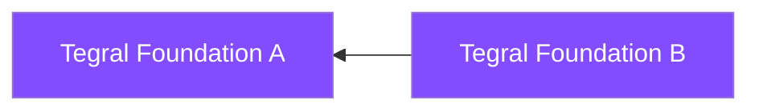
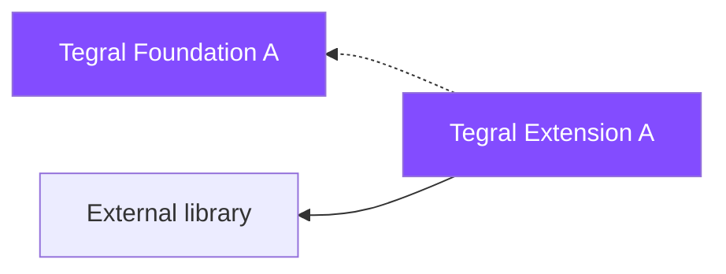
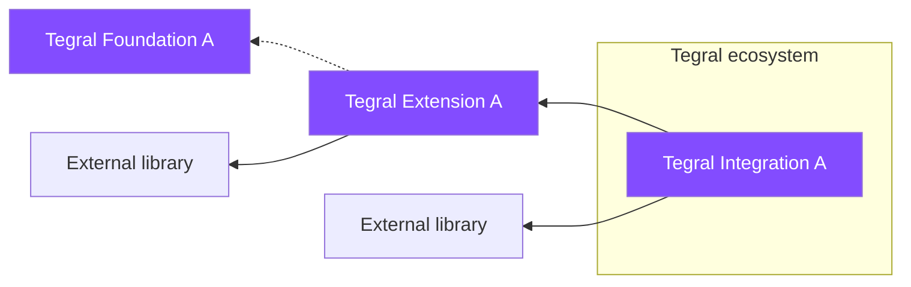

# Modules

Tegral is made of several modules that act like independent libraries.

This section provides reference material for all the components.

## Libraries

You will find several kinds of such libraries in Tegral:

### Foundation

Foundation libraries provide values in themselves and are not wrappers over existing *non-Tegral* libraries.

For simplicity, foundation libraries can also be extensions or wrappers over existing *Tegral* libraries.

### Extension

Extension libraries extend existing non-Tegral libraries, adding significant functionality.

Extension libraries can also depend on Foundation libraries, provided that the goal behind the dependency is not an "integration in the broader Tegral ecosystem". For example, anyone should be able to pick up a Tegral extension library to add features to an external library *without* using everything provided in Tegral.

### Integration

Integration libraries aim to both:

- Make multiple unrelated components coexist together
- Provide (or help towards providing) a cohesive "Tegral Ecosystem" experience.

