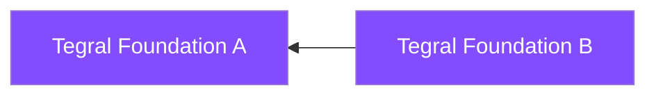
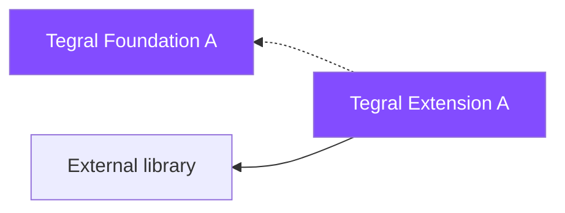
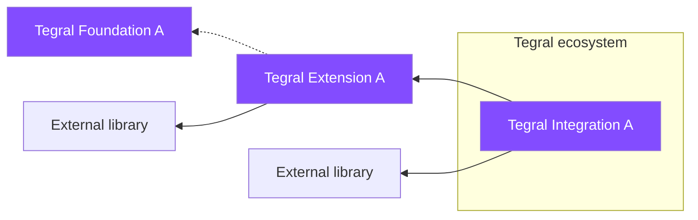

# Modules

Tegral is made of several modules that act like independent libraries.

This section provides reference material for all the components.

## Libraries

You will find several kinds of such libraries in Tegral:

### Foundation

Foundation libraries provide values in themselves and are not wrappers over existing *non-Tegral* libraries.

For simplicity, foundation libraries can also be extensions or wrappers over existing *Tegral* libraries.

### Extension

Extension libraries extend existing non-Tegral libraries, adding significant functionality.

Extension libraries can also depend on Foundation libraries, provided that the goal behind the dependency is not an "integration in the broader Tegral ecosystem". For example, anyone should be able to pick up a Tegral extension library to add features to an external library *without* using everything provided in Tegral.

### Integration

Integration libraries aim to both:

- Make multiple unrelated components coexist together
- Provide (or help towards providing) a cohesive "Tegral Ecosystem" experience.

## Design philosophy

When creating or designing Tegral-based content, the following should be kept in mind:

- **The build process of users should not be impacted.** This means that no Tegral module may force the use of custom build processing. This excludes Gradle plugin, code generation or build tool complications. Exceptions are made in cases where use of such modules is not mandatory (e.g. [catalogs](core/catalog/index.md))
- **Expect developers to only use parts of Tegral**, especially for core modules. Most modules should be usable as-is, especially for parts that have added business value.
  - In the case of Tegral Web modules, modules should have the following kept in separate modules to keep the business logic usable by anyone.
    - Core business value-adding functions, classes and utilities
    - Ktor plugins
    - Actual Tegral feature
- **A feature that is not documented does not exist.** This documentation website tries to use [diàtaxis](https://diataxis.fr). Features offered by the various modules should be described in:
  - KDoc documentation (MUST). This mostly consists in simple and concise explanations of the exact functions.
  - Usage reference in the docs (MUST).
  - How-to in case this contributes to a larger "user goal" (SHOULD).
  - Tutorial or integration in an existing tutorial if the feature brings significant value (MAY).
  - Explanations if needed (MAY).
